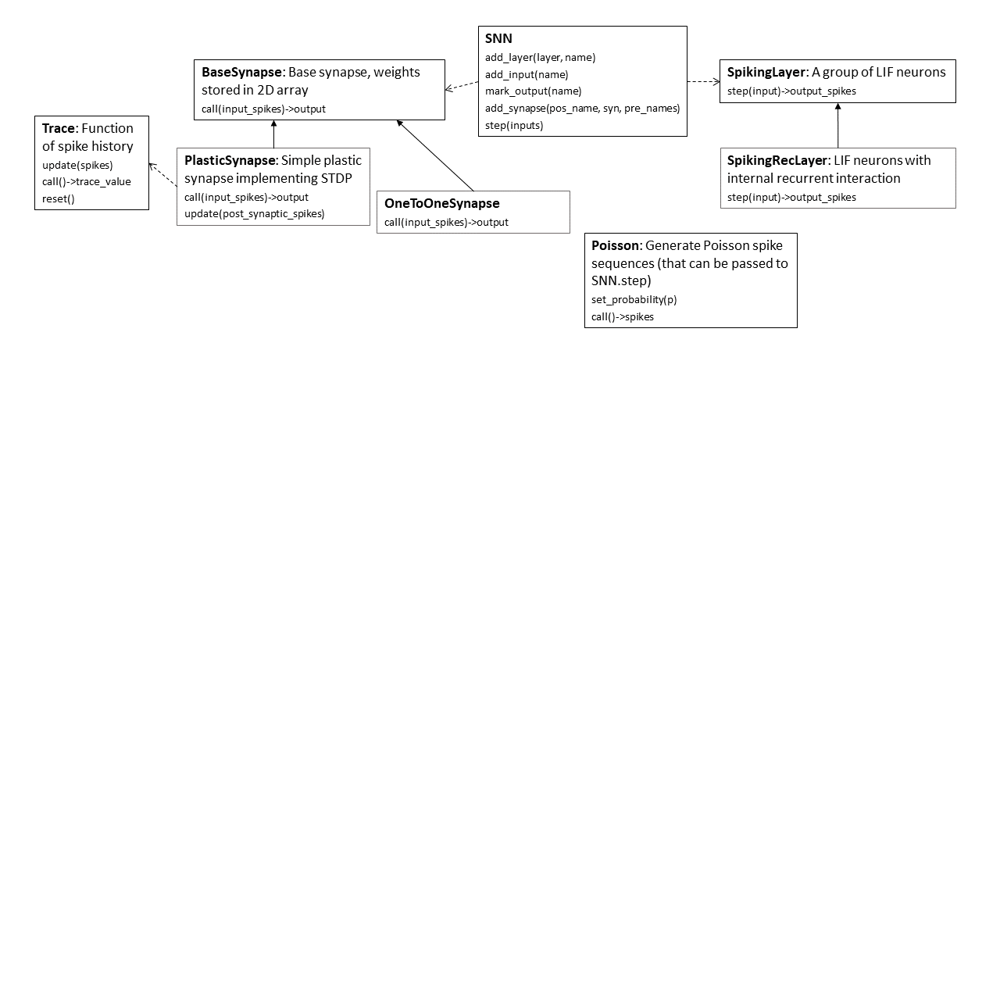

# Spikelearn

An implementation of spiking neural networks with online learning capability, using `numpy`.

This project is still under further development, and a related paper is in submission. We will release the code in the future.

## Block Diagram

The block diagram below shows the current architecture of this framework, along with major function blocks:

